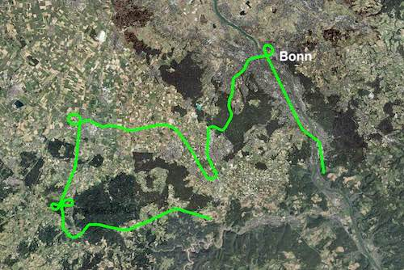
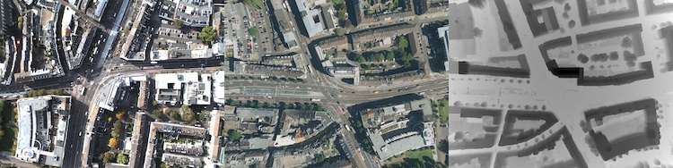
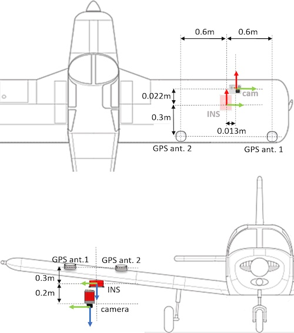

# VPAIR - Aerial Visual Place Recognition and Localization in Large-scale Outdoor Environments


## Dataset Description

The dataset was recorded on board a light aircraft flying at an altitude of
more than 300 meters above ground capturing images with a downwardfacing 
camera. Each image is paired with a high resolution reference render 
including dense depth information and 6-DoF reference poses.
The dataset covers a more than one hundred kilometers long trajectory over 
various types of challenging landscapes, e.g. urban, farmland and forests 
between the city of Bonn, Germany and the Eifel mountain range.



The dataset consists of 2706 query and reference image pairs. The reference
images were rendered based on public geodata and are accompanied with 
3D-depth information that is. Additionaly, there are 10.000 distractor images that
were rendered based on geodata from a geographically similar area. The 6-DoF
reference poses are based on the GPS-coordinates for the positional information
and on a local coordinate system in NED-convention for the orientation.



## Sensor Setup



## Download

Download Sample Data for Review.  ([Link](https://zenodo.org/record/6473989#.YmB_XC8esQw)) Size: 0.86GB

To request full access to the dataset please fill out the following form ([Link](https://forms.gle/59p52AXCW1ozT5b28)).

## License

The dataset is for academic use only. Commercial use is prohibited. If you use this dataset in your research please cite it accordingly:

```
@article{schleiss2022vpair,
  title={VPAIR-Aerial Visual Place Recognition and Localization in Large-scale Outdoor Environments},
  author={Schleiss, Michael and Rouatbi, Fahmi and Cremers, Daniel},
  journal={arXiv preprint arXiv:2205.11567},
  year={2022}}
```
